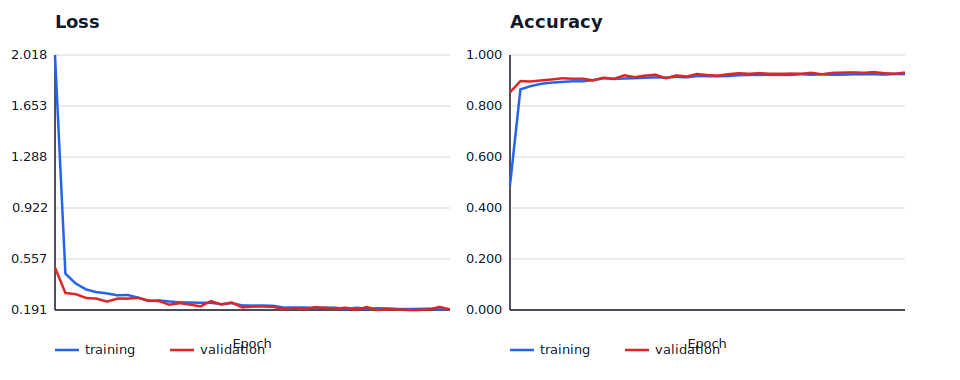

## Audio Classification

This repository explores audio (drum sound) classification using deep learning. The project focuses on experimenting with different model architectures and problem formulations to better understand what works (and what doesn’t) when classifying short percussive sounds such as kicks, snares, and cymbals.
The work was motivated by hands-on experimentation and discussion around the challenges of using sequence models (RNN/LSTM) for drum sound classification, and how alternative formulations can lead to more stable and interpretable results.

Motivation also came from personal involvment with music and sound and recurring usecase of having to quickly draft music ideas.
This was an attempt to explore how simple would it be to make simple music drafts transcribed as MIDI, by simply tapping, humming, whistling, beatboxing or simply feeding an existing recording.

Problem is multi-fauceted ofcourse, and at the moment, main focus is on drum detection/classification, but further efforts would be directed into note transcription and instrument categorization for other instruments.

## MIDI Transcription / Pitch-to-MIDI

This repository also contains a separate `pitch_to_midi/` side project for melodic transcription: humming, singing, whistling, or playing a monophonic line and converting it into MIDI notes. The goal is to test different machine-learning approaches for quick sound sketches, where audio can become editable MIDI instead of staying as a rough recording.

The pitch-to-MIDI work is intentionally kept in its own folder for now so the drum-classification code remains clean. It includes generated-data training pipelines, augmentation experiments, and a small piano-roll GUI for more intuitive testing and parameter tuning. See [`pitch_to_midi/README.md`](pitch_to_midi/README.md) for the detailed roadmap and commands.

## Repository Idea

Purpose of this project was following:

- Utilize ML algorithms to detect and categorize the events of drum hits (Kick, Snare, HiHat etc)
- Test performance of different types of NN such as simple FF, temporal CNN, 2D-CNN...
- Show that a relatively robust solution can be obtained with relatively scarce and uniform data samples (~160 each)
- How the improvement in robustness can be achieve via data-augmentation
- Explore how problem formulation impacts model performance more than model complexity (binary vs multilabel classification)
- Build a small but flexible codebase that can be extended with new models and datasets (easy to fine tune using few new samples)

## 🧠 Key Insight

Although audio is inherently sequential, not all audio classification problems benefit from recurrent models. For short, transient sounds like drum hits:
Most discriminative information lies in the attack phase (first ~200–300 ms).
Treating audio as a fixed-length feature representation can outperform sequence modeling.
Simplifying the task (e.g., binary classification) can dramatically improve learning stability.

## ♬ Input data format

Training data is generated from  audio files (either .wav or .ogg) loaded using Librosa library.
Input audio data is typically of 4 different types of drums, as seen below (this may be extended later for note transcription tasks):


Audio data is then converted into spectrograms using STFT with NFFT of 1024 bins, for further processing in the frequency domain:


Individual audio files are loaded randomly in a loop and concatenated with periods of silence of random length in between.
Both recorded and artifical background noises are added to the silence to improve data realism.
Some further data augumentation techniques are applied on each batch sample, such as filtering, random masking, time warping etc, which increases robustness of the trained algorithm.
During concatenation, labels are generated from the file/folder names. 
Resulting training and validation data batch samples look somewhat like the example shown below (before augmentation):


## 🧩 Problem Formulations (Two Branches)

This repository supports two different ways of formulating the classification problem, which can be treated as conceptual “branches” of the project.
At this point, individual drums appear in data one at a time and there is no overlap. Other approaches shall be further explored in the future.

🔹 Branch 1: Multi-Class Drum Classification

   Problem statement:

   Given a short audio clip, predict which drum class it belongs to
   (e.g., kick, snare, cymbal, hi-hat).

   Characteristics:

   - Multi-class classification
   - Higher ambiguity between similar sounds
   - More sensitive to dataset imbalance and labeling noise
   - Useful for understanding model limitations

Typical label set: 
       
      { kick, snare, cymbal, hihat, tom }

🔹 Branch 2: Binary / One-vs-Rest Classification

   Problem statement:

   Given a short audio clip, determine whether it belongs to a specific drum class or not
   (e.g., “kick” vs “not kick”).

   Characteristics:

   - Binary classification
   - Easier optimization and interpretation
   - Often better accuracy with limited data
   - Useful as a stepping stone before multi-class classification

   Example tasks:

    ''kick vs not-kick
    snare vs not-snare''

## 🏗 Available Model Types

The repository includes implementations and experiments with the following model families:

🔸 1. Feed-Forward (Dense) Models

  - Operate on fixed-size feature vectors (e.g., flattened spectrograms)
  - Simple baseline
  - Often surprisingly effective for short, percussive sounds
 
  Use case:
  Quick experiments, debugging pipelines, baseline performance.

🔸 2. Recurrent Models (RNN / LSTM)

Process audio features as temporal sequences
Designed to model time dependencies

Observations:
 - Harder to train reliably on short drum sounds
 - Sensitive to sequence length and padding
 - Often unnecessary when temporal structure is minimal

Use case:
Exploratory learning and understanding sequence modeling limitations.

🔸 3. Spectrogram-Based Models (CNN-style inputs)

Treat spectrograms as 2D representations

Enable spatial pattern learning in time–frequency space

Note:
While full CNN architectures may not be fully implemented yet, the codebase is structured to support them easily.

## 📁 Repository Structure

```text
├── Drum_classification.ipynb   # End-to-end demo notebook
├── augmentations.py            # Audio data augmentation utilities
├── main_model_train.py         # Training entry point
├── model_prediction.py         # Inference / evaluation script
├── models.py                   # Model definitions
├── utils.py                    # Audio loading and preprocessing
└── .gitignore
```

## 🚀 Typical Workflow

Load and preprocess audio files (e.g., STFT or mel spectrograms)
Choose a problem formulation (multi-class or binary)
Select a model type
Train using main_model_train.py
Evaluate or predict using model_prediction.py

EDIT: Repo is to be migrated and run on AWS with a GUI which will allow easier exploration of the model training, fine-tuning and evaluation .

## 🛠 Requirements (Example)
pip install numpy librosa tensorflow scikit-learn matplotlib

📌 Results

TBD

🔮 Possible Extensions

Full CNN architectures for spectrogram inputs
Transformer-based audio models
Simultaneous drum hits
Velocity/pitch detection in other instruments
Fine tuning
Develop interface for fine-tuning and parametrization and host on AWS
Real-time audio classification

📜 License

MIT License (or update as needed)

---

## Pitch transcription: experiment progress

The project has moved beyond isolated-note classification. The current task is **monophonic sequence transcription**: given a complete phrase, predict an aligned sequence of `silence` or MIDI pitches C2-C5. Training phrases contain pauses, legato transitions, and overlapping acoustic tails.

### What changed and what mattered

| Experiment | Evaluation domain | Frame accuracy | Note-only accuracy | Within 1 semitone | Main conclusion |
|---|---:|---:|---:|---:|---|
| Early STFT baseline | generated phrases | about 25% | - | - | It mostly learned the frequent silence class. Accuracy alone hid the failure. |
| CQT + CNN, LR 0.005 | generated phrases | 86.9% | 92.4% | 94.0% | Preserving absolute frequency position and using pitch-aligned CQT bins fixed the plateau. |
| CQT + BiGRU, LR 0.005, augmentation | generated phrases | 89.8% | 92.1% | 92.8% | Temporal context and augmentation improved the overall sequence model. |
| Synthetic model, zero-shot | TinySOL fold 1 | 82.1% | 79.7% | 83.2% | The synthetic-to-recorded domain gap is real but transfer is already useful. |
| Internal synth + TinySOL | TinySOL fold 1 | 88.4% | 89.0% | 89.3% | Mixing recorded samples into training produced the best balanced TinySOL result. |
| SoundFont + TinySOL | TinySOL fold 1 | 87.3% | 90.2% | 91.4% | Sample-based timbres improved pitch accuracy but made boundaries worse. |
| SoundFont + TinySOL | NSynth test, evaluation only | 81.0% | 83.2% | 84.9% | Generalization to unseen instruments remains the central challenge. |
| **GPU full CQT+BiGRU** | **TinySOL fold 1** | **93.1%** | **95.7%** | **95.8%** | Best current model; full weights were saved for the GUI. |
| **GPU full CQT+BiGRU** | **NSynth test, evaluation only** | **85.9%** | **87.3%** | **87.7%** | Improved cross-instrument transfer, but NSynth remains harder. |
| Raw TCN, initial 4-epoch run | generated phrases | 28.6% | 0.0% | 0.0% | It collapsed to silence; the raw path works technically but is not yet competitive. |

The stored, reproducible result files are in [`pitch_to_midi/experiments`](pitch_to_midi/experiments), including `raw_tcn_initial.json` for the first raw-waveform negative result. In addition to aggregate accuracy, they record class histograms, sample label timelines, silence calibration, semitone error, and onset/offset errors. This was important because a model can report plausible accuracy while predicting silence or a small number of notes most of the time.

### Conclusions so far

- The original roughly 25% plateau was not simply a need for a larger network. Feature geometry mattered: averaging across frequency erased the absolute position that identifies pitch.
- A learning rate of `0.005` worked well in this setup. Architecture and data-domain changes mattered more than transition weighting.
- Domain transfer is promising. Adding TinySOL recordings substantially improved recorded-instrument performance, and the NSynth test exposed the remaining cross-instrument gap.
- The roughly 112 ms offset error in one boundary-weighted run is not currently the limiting issue. Natural release tails do not exactly match symbolic note-off labels, and the target use case tolerates this amount of offset uncertainty.
- Frame accuracy must always be read together with note-only accuracy, silence fraction, predicted-class coverage, and semitone distance.

### What is still difficult

- **Voice and microphone domain shift:** the model has not yet been trained on enough humming, singing, whistling, room noise, or microphone variation.
- **Note boundaries:** acoustic release tails and human transitions are ambiguous even when pitch is correct.
- **Monophony:** targets currently allow one pitch per frame; chords and overlapping sources require multi-label outputs.
- **Raw-audio training cost:** learning the frequency representation from waveform samples needs more data and compute than supplying CQT features.
- **Streaming latency:** a bidirectional model can use the full phrase but cannot finalize the newest frames until future audio arrives. A causal TCN trades some accuracy for immediate output.

## Whole-waveform neural transcription

`sequence_pitch_pipeline.py` now supports a fully neural raw-waveform path. Seven strided 1D convolution blocks learn the audio representation and reduce 16 kHz waveform samples to one output every 128 samples (8 ms). Dilated residual temporal blocks then predict the complete label timeline.

This is different from isolated-window classification:

```text
entire waveform -> learned convolutional encoder -> temporal network -> aligned label sequence
```

The model accepts variable-duration audio. A whole file is passed through it in one call; it does not classify many short notes and fuse those decisions. Segment grouping remains available only as an optional readable/MIDI export layer.

Train a small raw-waveform experiment:

```powershell
cd .\pitch_to_midi
.\.venv\Scripts\python.exe .\sequence_pitch_pipeline.py `
  --feature-type raw --architecture raw_tcn `
  --learning-rate 0.005 --epochs 10 `
  --train-batches 200 --val-batches 40 --test-batches 40 `
  --save-model .\raw_tcn_pitch.keras `
  --results-json .\experiments\raw_tcn_pitch.json
```

`raw_tcn` is fully convolutional and suitable for low-latency preview. `raw_gru` adds bidirectional sequence context and is intended for higher-quality completed-recording transcription.

Transcribe an entire file in one forward pass:

```powershell
.\.venv\Scripts\python.exe .\neural_transcriber.py `
  --model .\raw_tcn_pitch.keras --audio .\example.wav `
  --output-json .\example_transcription.json
```

Preview predictions while a microphone buffer grows:

```powershell
.\.venv\Scripts\python.exe .\neural_transcriber.py `
  --model .\raw_tcn_pitch.keras `
  --microphone-seconds 30 --update-seconds 1
```

The preview reprocesses everything captured so far once per update. It is deliberately simple and correct before optimization. A production streaming version should cache causal convolution state so only new audio is processed.

### Next experiments

1. Establish raw TCN and raw BiGRU baselines on the same TinySOL/NSynth diagnostics as the CQT model.
2. Add recorded voice/whistle data and microphone/room augmentation; compare zero-shot and fine-tuned results.
3. Add confidence/uncertainty plots and connect raw neural predictions to the existing piano-roll GUI.
4. For live use, train a causal model and cache streaming state; for offline use, retain full left/right context.
5. Move to multi-label pitch targets only after the monophonic real-voice transfer is stable.

## Neural detector in the piano-roll GUI

The piano-roll GUI now supports two detector modes:

- **Neural CQT+BiGRU** (preferred): a 2.5-second rolling microphone buffer is converted to CQT and passed through the sequence neural network. The newest stable neural frame supplies the MIDI label and confidence. This uses the strongest architecture from the experiments; it is not isolated-note window classification.
- **YIN fallback**: the original `librosa.yin()` baseline remains available for comparison and for machines where trained neural weights are absent.

The GUI looks for `pitch_to_midi/cqt_gru_best.keras`. It validates the model during startup and automatically selects YIN if the file is missing or invalid. The existing small `.keras` files in this checkout contain model configuration but no weights and therefore are not silently accepted.

Launch the GUI:

```powershell
cd .\pitch_to_midi
.\.venv\Scripts\python.exe .\live_piano_roll.py
```

When a valid checkpoint is present, select **Neural CQT+BiGRU** in the Detector menu. Neural inference runs every 200 ms; detected notes continue through the existing optional grouping, replay, save/load, and piano-roll rendering functions.

### Completed GPU checkpoint

A full GPU run completed in WSL2 using CQT + CNN + BiGRU, 50/50 cached SoundFont and TinySOL phrases, 20% dropout, audio augmentation, best-validation-loss checkpointing, learning-rate reduction on plateaus, and early stopping. Each epoch used 1,600 freshly assembled 2.5-second phrases. Training stopped after epoch 39 and restored epoch 32, the minimum-validation-loss checkpoint.

| Metric | TinySOL fold 1 | NSynth test |
|---|---:|---:|
| Evaluation frame accuracy | 92.99% | 84.66% |
| Independent diagnostic frame accuracy | 93.09% | 85.95% |
| Note-only accuracy | 95.75% | 87.28% |
| Within one semitone | 95.83% | 87.75% |
| Onset MAE | 57.5 ms | 55.6 ms |
| Offset MAE | 110.4 ms | 106.7 ms |

Validation accuracy peaked at 93.30%; minimum validation loss was 0.1913. Training accuracy was around 92.5% near the end while validation remained around 93%, which is consistent with training augmentation making the training batches harder rather than evidence of severe overfitting. The learning-rate reductions at epochs 9, 18, 22, 28, and 35 repeatedly unlocked additional validation improvements.



Artifacts:

- `pitch_to_midi/cqt_gru_best.keras`: best validation-loss model, loaded automatically by the piano-roll GUI.
- `pitch_to_midi/cqt_gru_final.keras`: final model after early stopping restored the best weights.
- `pitch_to_midi/experiments/cqt_gru_gpu_full.json`: complete configuration, diagnostics, label histograms, and sample timelines.
- `pitch_to_midi/experiments/cqt_gru_gpu_full_history.csv`: per-epoch metrics and learning rates.
- `pitch_to_midi/experiments/cqt_gru_gpu_full_curves.svg`: loss and accuracy curves.

The remaining challenge is domain transfer to real microphone voice/whistling rather than validation overfitting. NSynth results improved substantially but still trail TinySOL, and neither isolated-note dataset fully represents continuous human vocal transitions.
