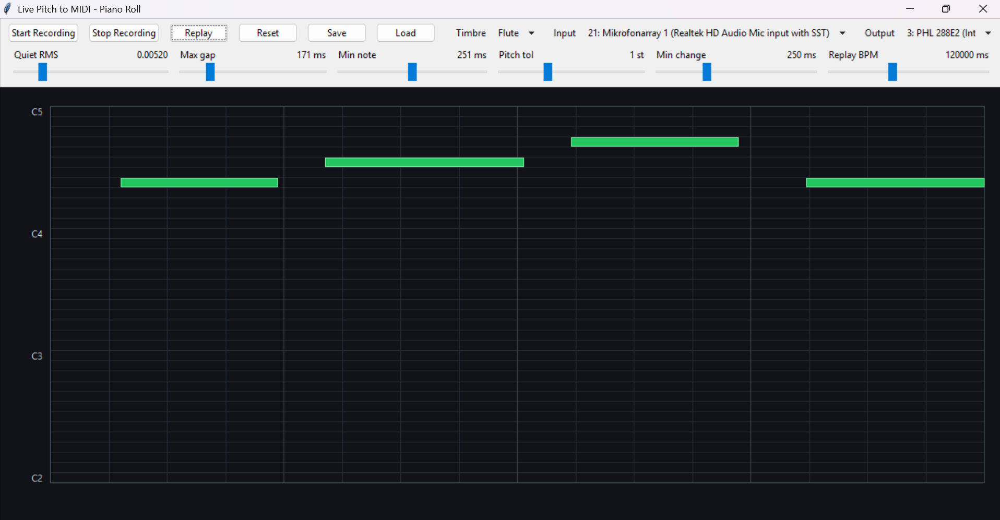

# Pitch to MIDI side project

This folder contains the melodic transcription side of the larger audio-to-MIDI project. The long-term goal is an app for fast musical sketching: hum, sing, whistle, beatbox, tap, or play a rough idea, then turn the detected events into editable MIDI.

For now this stays separate from the drum-classification code so experiments stay easy to reason about. The folder includes generated-data ML pipelines, audio augmentation, sample/synth rendering, and a small piano-roll GUI used to inspect and tune detection behavior.

The GUI is not the final model. It is a practical testing surface: it lets us see raw detector chunks, grouped notes, pitch transitions, replay timing, and how parameter changes affect transcription before those ideas are moved into a trained model.

## Current roadmap

- Generate arbitrary monophonic MIDI-note sequences in memory.
- Render them with simple synths now, and SoundFonts/sample packs later.
- Add augmentation such as noise, gain, stretch, reverb, pitch variation, and timing variation.
- Train small baseline models first, then compare CNN-style spectrogram models and sequence models.
- Evaluate whether synthetic pretraining transfers to humming, singing, whistling, and real instruments.
- Use the piano-roll GUI to tune and inspect results while the ML pipeline matures.

## Current approach

The first scripts generate fresh batches during training:

```text
random MIDI note -> rendered audio -> augmentation -> CQT features -> neural net
```

The feature extractor uses **CQT** instead of a plain STFT. CQT bins are spaced like musical notes, so the first model gets a much clearer pitch signal.

## Renderers

Preferred renderer:
- **pretty_midi + FluidSynth + `.sf2` SoundFont**.
- This gives real sample-based instrument timbres.
- Requires the native FluidSynth library on Windows.

Fallback renderer:
- A tiny internal harmonic synth.
- This is not as realistic as SoundFont audio, but it still renders from MIDI note labels and lets the ML pipeline run without saving audio files.


## One-command environment setup

Windows PowerShell:

```powershell
cd "C:\path\to\audio-classification\pitch_to_midi"
.\setup_env.ps1
```

Linux or WSL2:

```bash
cd /path/to/audio-classification/pitch_to_midi
bash ./setup_env.sh
```

The scripts create `.venv`, upgrade `pip`, and install `requirements.txt`. For serious GPU training, prefer Linux/WSL2 with a TensorFlow build that can see the GPU. Native Windows TensorFlow may run CPU-only.

## Setup

A local virtual environment was created here:

```text
.venv
```

Run with:

```powershell
cd "C:\Users\a.pasagic\Python Projects\audio-classification\pitch_to_midi"
.\.venv\Scripts\python.exe .\pitch_to_midi_skeleton.py
```

Or install from scratch:

```powershell
py -3.11 -m venv .venv
.\.venv\Scripts\python.exe -m pip install -r requirements.txt
.\.venv\Scripts\python.exe .\pitch_to_midi_skeleton.py
```

## SoundFont mode

`pretty_midi` includes a small bundled SoundFont:

```text
.venv\Lib\site-packages\pretty_midi\TimGM6mb.sf2
```

To use it, the native FluidSynth library must also be installed and discoverable by Python. Then set:

```powershell
$env:PITCH_TO_MIDI_SF2="C:\path\to\TimGM6mb.sf2"
.\.venv\Scripts\python.exe .\pitch_to_midi_skeleton.py
```

On this machine, `pyfluidsynth` installed correctly, but the native FluidSynth library was not found, so the test used the fallback synth.

## Latest smoke test

Using the fallback harmonic synth and CQT features:

```text
classes: 25 MIDI notes, C3 through C5
random chance: about 4%
training: 8 epochs, generated fresh in memory
final validation accuracy: 65.62%
```

That is enough to confirm the network is learning pitch structure.


## Microphone pitch detector

A simple live microphone baseline is included:

```powershell
.\.venv\Scripts\python.exe .\mic_pitch_detector.py
```

It records short microphone chunks, estimates pitch with `librosa.yin()`, converts Hz to MIDI note number, and prints the result. This does not use the neural net yet. It is useful as a quick realtime sanity check before adding a live display or MIDI output.


## Live piano-roll view

A tiny Ableton/FL-style piano-roll display is included:

```powershell
.\.venv\Scripts\python.exe .\live_piano_roll.py
```



The GUI uses the trained **CQT + Bi-GRU** model by default and falls back to librosa YIN if the model artifact is unavailable. It automatically selects a physical microphone where possible, runs a startup RMS test, and shows the live RMS beside the configurable silence gate. Recent-chunk RMS, neural confidence, and the learned silence class all have to accept a frame before it becomes a note.

Use **Start Recording**, **Stop Recording**, and **Replay** for microphone capture. **Load Audio** accepts WAV, FLAC, OGG, or MP3 recordings and runs whole-file neural inference in a background thread; **Play Source** plays the original file, while **Replay** synthesizes the detected piano roll. The file picker starts in sequence_previews, which contains generated WAV/JSON pairs with known note events. **Save** and **Load** handle editable JSON piano-roll sessions.

The toolbar is split into responsive rows and the six tuning sliders use a 3-by-2 grid, so the piano roll remains usable on smaller screens. The detector remains monophonic and covers MIDI C2-C5.


## GUI and tuning

`live_piano_roll.py` is a small Tkinter test interface for microphone input and replay. It exists so detector behavior can be seen directly instead of only measured through logs. The important controls expose pitch tolerance, gap merging, minimum note length, replay speed, zoom behavior, and input device selection.

This is especially useful while the project is still between classical pitch tracking and neural transcription: the GUI shows where notes are chopped, merged, missed, or shifted, which gives concrete failure cases for the next ML pipeline.

## STFT CNN pipeline

A slightly more realistic generated-data CNN starter is included:

```powershell
.\.venv\Scripts\python.exe .\cnn_pitch_pipeline.py
```

For a fast smoke test:

```powershell
.\.venv\Scripts\python.exe .\cnn_pitch_pipeline.py --epochs 1 --batch-size 2 --train-batches 1 --val-batches 1 --test-batches 1
```

Pipeline:

```text
random MIDI note -> rendered audio -> augmentation -> log-STFT image -> 2D CNN -> one MIDI-note class
```

Current target type is single-label classification: one note is active in each generated clip, and the network outputs one MIDI class from C2 through C5. This is intentionally simpler than real transcription. The next modeling step would be frame-level labels on longer spectrogram windows, so the network can learn note starts, note ends, and pitch duration rather than only one label per clip.

Augmentation currently includes random gain, noise, time shift, time stretch, small cents-level pitch variation, and simple synthetic reverb. These are generated in memory; no large audio dataset is written to disk.


## Transcription target

The desired output is not just a list of isolated pitches. The practical target is a MIDI-like sequence:

```text
note number + note start + note duration + optional velocity
```

The current sequence pipeline treats this as frame-wise classification: each spectrogram frame is either silence or one active MIDI note. That is a simpler first step than full onset/offset/velocity prediction, but it matches the first use case: one melodic line at a time.

## Sequence transcription pipeline

`sequence_pitch_pipeline.py` is the next step toward real humming/singing-to-MIDI transcription. Instead of one isolated note per example, it generates short monophonic phrases with random MIDI notes, durations, pauses, legato joins, and overlapping rendered note tails. The model sees a log-STFT image and predicts one label for every spectrogram time frame:

```text
silence OR one MIDI note from C2 through C5
```

That makes it a frame-wise transcription starter rather than a whole-clip classifier. It is still monophonic, so it matches the first practical goal: hum, sing, whistle, or play one melody line and convert it to MIDI.

Generate preview phrase WAVs and matching JSON labels:

```powershell
.\.venv\Scripts\python.exe .\sequence_pitch_pipeline.py --preview-only --write-previews 5 --phrase-seconds 3 --preview-dir .\sequence_previews
```

Tiny smoke test:

```powershell
.\.venv\Scripts\python.exe .\sequence_pitch_pipeline.py --epochs 1 --batch-size 1 --train-batches 1 --val-batches 1 --test-batches 1 --phrase-seconds 2 --save-model .\sequence_pitch_smoke.keras
```

Moderate overnight CPU run:

```powershell
.\run_sequence_overnight.ps1
```

Stronger future run, preferably in WSL2/GPU or another accelerated environment:

```powershell
.\.venv\Scripts\python.exe .\sequence_pitch_pipeline.py --epochs 50 --batch-size 8 --train-batches 500 --val-batches 80 --test-batches 80 --phrase-seconds 4 --architecture cnn_gru --save-model .\sequence_pitch_large.keras
```

Current limitation: on this native Windows setup, TensorFlow reports no GPU support, so serious training will be slow. The generated-data design is still useful: we can pretrain on unlimited synthetic phrases, then mix in more realistic SoundFont/sample-pack/recorded voice data so the model does not overfit to the fallback synth.

## Files

- `pitch_to_midi_skeleton.py`: first CQT training loop and tiny neural net.
- `cnn_pitch_pipeline.py`: generated-data log-STFT + 2D CNN starter pipeline for isolated notes.
- `sequence_pitch_pipeline.py`: generated phrase transcription starter with frame-wise labels.
- `run_sequence_overnight.ps1`: moderate CPU training command for the sequence model.
- `midi_renderer.py`: SoundFont renderer plus fallback synth renderer.
- `augment_audio.py`: label-preserving augmentation.
- `requirements.txt`: Python package list.

## Possible improvements

- Install native FluidSynth so SoundFont rendering works on Windows.
- Add more SoundFonts and randomly choose one per note.
- Randomize General MIDI instrument programs more broadly.
- Add room impulse responses or reverb augmentation.
- Add pitch-shift augmentation only if the MIDI label is shifted too.
- Add sample-bank rendering: choose real recorded note samples instead of SoundFonts.
- Add polyphonic labels later, where the target becomes multiple simultaneous MIDI notes.
- Add real MIDI export after prediction, once note timing/onset detection exists.


## Later transcription idea

For cleaner transcription, record the full audio first, then run a larger sliding analysis window over it offline. That can reduce realtime pressure, use bidirectional context, and eventually let a CNN-style model predict note, length, and velocity directly from spectrogram regions.


## Input device selector

If raw chunks show nothing, choose a different input device in the UI. On this machine, device 19: Mikrofonarray 2 showed a much stronger signal than the default microphone mapper during testing.


## Current results and next-generation model

The main project README now contains the experiment table, conclusions, remaining problems, and commands for the raw-waveform whole-sequence model: see [`../README.md`](../README.md#pitch-transcription-experiment-progress).

Two inference modes are supported by `neural_transcriber.py` after training a raw model:

- whole-file transcription in one neural-network call;
- repeated preview on the complete microphone buffer as it grows.

The existing CQT pipeline remains the stronger baseline. The raw TCN/BiGRU path is intentionally experimental until it is benchmarked on the same TinySOL and NSynth splits.

## Completed GPU CQT + BiGRU model

The full WSL2 GPU training run is complete. The saved `cqt_gru_best.keras` checkpoint is now the default neural detector used by `live_piano_roll.py`. It achieved 93.1% diagnostic frame accuracy and 95.7% note-only accuracy on TinySOL fold 1; NSynth evaluation-only diagnostic accuracy was 85.9% frame-wise and 87.3% on note frames. See the main README for the full table and learning curves.
## Hard-negative candidate

A separate CQT + Bi-GRU candidate was trained with 15% pure silence, broadband noise, 50/60 Hz hum, and colored-noise examples. It ran for 39 epochs and selected epoch 32 by validation loss.

| Evaluation | Original model | Hard-negative candidate |
|---|---:|---:|
| TinySOL frame accuracy | 93.09% | 92.81% |
| TinySOL note-frame accuracy | 95.75% | 95.67% |
| NSynth frame accuracy | 85.95% | 84.91% |
| NSynth note-frame accuracy | 87.28% | 86.30% |
| Generated hard-negative accuracy | Not measured | 100.00% |

The candidate is not promoted automatically: it solves the tested silence/noise behavior but loses about one percentage point on NSynth. Its metrics and learning curve are stored under experiments/cqt_gru_hard_negative.

For remote-desktop use, microphone input works only when the remote client redirects a microphone and Windows exposes it as an input device. A Remoteaudio output device does not provide microphone samples. Recorded-file transcription does not require a microphone and runs in a process-isolated worker with a 120-second timeout.
